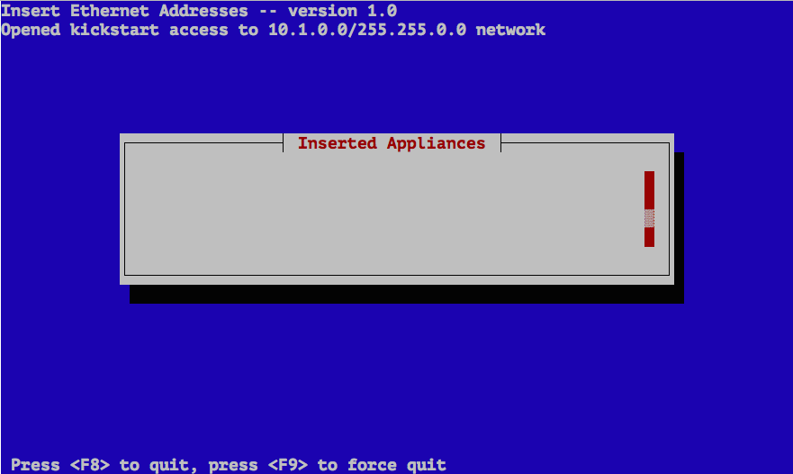

After the frontend is up and running, backend nodes can be installed.

## Requirements 

A backend has the following hardware requirements. 

**Resource** | Minimum | Recommended
--- | --- | ---
**System Memory** | 3 GB | 8 GB
**Network Interfaces** | 1 (PXE-Capable) | 1 or more (PXE-Capable)
**Disk Capacity** | 40 GB | 100 GB

BIOS _boot order_

1. PXE (Network Boot)
2. CD/DVD Device (Optional - Only if device is present)
3. Hard Disk

## Discovery or SpreadSheet

To install a new backend node, Stacki needs to add information about
the server (IP address, MAC address, appliance type, etc) to the
configuration database.
Choose between the [Discovery](#discovery) or [SpreadSheet](#spreadsheet) procedure to install
your new backend nodes.

### Discovery

In this mode the frontend will listen for any host requesting a
DHCP address and will respond with an address from its managed private
network.
The DHCP response will also be a PXE response that will tell the
server to install/re-install itself.
Does this sound scary? Good, it is. It is also a great method to
quickly add new backend nodes, provided you are on an isolated private
network. It's not a good method if you don't control the private network.

Check with your networking group. If they say "no" ("Hell no!", "Seriously?", and 
"Not in your lifetime" are all versions of "no.") or promiscuous DHCP on a subnet 
causes you nightmares, use the [SpreadSheet](#spreadsheet) procedure instead. 

If you're testing (Virtual Box/VMWare) and control the network environment, Discovery 
works great.

To start discovery mode, log into the frontend as root and run the following:

```
# insert-ethers
```

This will bring up a screen that shows a list of appliances available
for installation.

 

By default only the _Backend_ appliance will be listed.
Press _OK_ to continue and then turn on the machine you want
installed.



Once the backend node sends out a PXE request, the frontend captures the
request and adds it to the Stacki database.

The default ordering for "insert-ethers" assigns the name to:
_appliance_-_rack_-_rank_. Where "rank" is assigned in the order
a backend node is discovered. 

If the server did not PXE boot, go back to the
[Requirements](#requirements) and verify the BIOS boot order.


Once the backend node downloads its Kickstart file, a '*' will appear next 
to the hostname assigned to the new backend node. 


Continue to turn on any other machines you want installed and hit _F8_
when done to quit "insert-ethers."

### Spreadsheet

You can also specify all the information about a host before
installation in a CSV (Comma Separated Value) file.
The advantage of using CSV files, is that it gives fine-grained control over the
configuration of the cluster.

The disadvantage is you have to know the MAC addresses prior to installing backend nodes. 
If you didn't get a listing from the vendor, you'll have to harvest them with IPMI or 
someone's eyeballs.

The Host CSV file needs to have the following columns:

1. **Name**. A hostname.
1. **Appliance**. The appliance name for the host (e.g. backend).
1. **Rack**. The rack number for the host.
1. **Rank**. The position in the rack for the host.
1. **IP**. Network address.
1. **MAC**. Ethernet address.
1. **Interface**. Ethernet device name (e.g. em1).
1. **Network**. Network name for the interface (e.g. private).

A 
[sample spreadsheet](https://docs.google.com/spreadsheets/d/19xk_tlvD5dYgLxfZpQVuVtAUGdKi3KCoqRVFVMTJA7w/edit?usp=sharing)
is shown below. 

 


Once the CSV file is created and copied to the frontend it can be
loaded by root.

```
# stack load hostfile file=hostfile.csv
```

You can verify the data was correctly loaded be listing the host
information from the configuration database.

```
# stack list host
HOST          RACK RANK CPUS APPLIANCE BOX          RUNACTION INSTALLACTION
frontend-0-0: 0     0   1    frontend  default      os        install      
backend-0-0:  1     1   2    backend   default      os        install      
backend-0-1:  1     2   4    backend   default      os        install      
backend-0-2:  1     3   4    backend   default      os        install
```

By default number of CPUs on every backend node is set to 1.
This value will be updated automatically once a backend node
is installed.

Every time a backend node boots, it will send a PXE request to the
frontend. The frontend will tell the backend node to either boot its OS or to
install. The default boot action is always _os_ as you can see below.

```
# stack list host boot
HOST          ACTION
frontend-0-0: ------ 
backend-0-0:  os
backend-0-1:  os
backend-0-2:  os
```

In order to install a backend you will need to switch the boot action
to _install_ and then reboot.

```
# stack set host boot backend action=install 
```

```
# stack list host boot
HOST          ACTION
frontend-0-0: ------ 
backend-0-0:  install
backend-0-1:  install
backend-0-2:  install
```

Now power up the backend machines.
The backend machines will first boot into the Stacki installer,
install the OS, set its boot action back to _os_ and reboot.

## Re-Installation

Because Stacki manages the PXE boot of all of backend nodes, when it
comes time to re-install a machine you can just change the boot
action back to _install_, for example:

```
# stack set host boot backend-0-0 action=install
```

The next time you boot _backend-0-0_, it will rebuild itself.
But a rebuild, by default, will only reformat the swap, ```/var```, and ```/``` partitions.
This means all data in ```/export```, or any other data disks you've partitioned, 
is maintained across re-installations.

If you want to completely reformat all data on the backend during the
re-installing you need to set an Attribute for the given host before
you reboot the server.

```
# stack set host attr backend-0-0 attr=nukedisks value=true
```

To do all backend hosts at once, give the appliance name:

```
# stack set host boot backend action=install
# stack set host attr backend attr=nukedisks value=true
# stack run host backend command=reboot
```

After the backend re-installs, it will automaticaly reset the value of the
attribute to _false_ so the next time you re-install, it will do the default
and only reformat the ```/var``` and ```/``` partitions.
