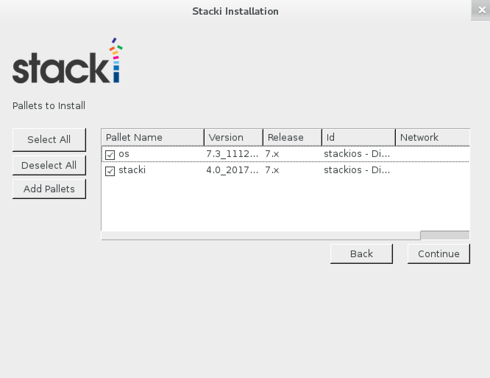

Stacki requires a single server that will host all 
the software and services used to build out other servers. We 
call this server the **frontend**, and the first step to running 
Stacki is to build a frontend. 

The process is fairly simple and looks similar to a standard Linux
build with the addition of a wizard to capture site-specific
networking information.

## Requirements 
 
A frontend has the following hardware requirements

| Resource | Minimum | Recommended |
| -------- | ------- | ----------- |
| System Memory | 2 GB | 16 GB |
| Network Interfaces | 1 | 1 |
| Disk Capacity | 64 GB | 200 GB |
| CD/DVD Device | 1 | 1 |

BIOS _boot order_
 
1. CD/DVD Device
2. Hard Disk

In the simplest configuration, Stacki assumes a single network for all
servers.
Stacki refers to the single network as the _private_ network, 
and often this will be an isolated network.
This default setup in shown below.

  

The private network cannot have a DHCP server that would answer 
a DHCP request from a backend server, as this is the resposibility of
the frontend.

> Stacki 1.x requires a _public_ and _private_ network

## New or Existing

Stacki can build a [new](#new) frontend from bare metal or it can be added on
top of an existing server.
If you wish to install Stacki on top of an existing system, skip to the
section labeled [existing](#existing).

### New

Download the Stacki jumbo DVD [here](http://stacki.s3.amazonaws.com/3.0/stacki-os-3.0.1-6.x.x86_64.disk1.iso) and burn the file to a DVD or
mount it on the virtual media for the server to be installed.
Installing a frontend will completely erase and reformat the hard disks in the
server, so be careful which server you decide to become your frontend.

Boot the server with the DVD (or virtual media mounted) and the
following screen will appear after the BIOS is initialized:

If you don't see the above screen, go back to
the [requirements](#requirements) section and
make sure the DVD is the first entry in the boot order.

You can hit enter or just wait a few seconds and the Stacki
frontend installation will begin, and you will soon see the
[Installation Wizard](#installation-wizard).

### Existing

A Stacki frontend can be installed on top of an existing Red Hat based server.
The server must be running the x86_64 version of CentOS 6.x or RHEL 6.x.

To perform this installation, log into the frontend and download two ISOs:

1. **Stacki**. The Stacki ISO can be found [here](http://stacki.s3.amazonaws.com/3.0/stacki-3.0.1-6.x.x86_64.disk1.iso). **IMPORTANT**: It is important that you supply the _stacki_ ISO and not the _stacki-os_ ISO. This ISO must be stacki-3.0.1-6.x.x86_64.disk1.iso.

2. **CentOS** or **RHEL** installation ISO. A CentOS installation ISO can be found [here](http://isoredirect.centos.org/centos/6/isos/x86_64/).

(If using RHEL, a DVD ISO should be available through your Red Hat subscription.)

Mount the Stacki ISO:

    # mount -o loop stacki-3.0.1-6.x.x86_64.disk1.iso /media

Copy frontend-install.py from the ISO to your local disk:

    # cp /media/frontend-install.py /tmp

Execute frontend-install.py:

    # /tmp/frontend-install.py --stacki-name=stacki --stacki-version=2.0 --stacki-iso=stacki-3.0.1-6.x.x86_64.disk1.iso --os-name=CentOS --os-version=6.7 --os-iso=CentOS-6.7-x86_64-bin-DVD1.iso,CentOS-6.7-x86_64-bin-DVD2.iso

> If you use CentOS 6.7, you are required to supply both CentOS DVDs as shown above.

The above step will run several commands and will eventually display
the [Installation Wizard](#installation-wizard).

## Installation Wizard

### Timezone

The first screen will appear and you will be prompted to enter your timezone:

### Network

The network configuration screen allows you to set up the network that will
be used by the frontend to install backend hosts.

1. _Fully Qualified Host Name_ - Input the FQDN for the frontend.
2. Choose from the network _Devices_ to select the frontend's network interface.
3. _IP_ address of the interface.
4. _Netmask_.
5. _Gateway_.
5. _DNS Servers_ - More than one DNS Server can be entered as a comma-separated list (i.e., 8.8.8.8, 4.2.2.2, 8.8.4.4).

Click _Continue_ to configure the network interface. 

### Password

Enter the password for the **root** account on the frontend.  

### Choose Partition

If _Automated_ mode is selected, the installer will
repartition and reformat the first discovered hard drive
that is connected to the frontend. All other drives
connected to the frontend will be left untouched.

| Partition Name | Size |
| -------------- | ---- |
|       /        | 16GB |
|       /var     | 16GB |
|       swap     |  1GB | 
| /export (symbolically linked to /state/partition1)|remainder of root disk|

When using automatic partitioning, the installer repartitions
and reformats the first hard drive (e.g. _sda_) that the installer
discovers. All previous data on this drive will be erased.
All other drives will be left untouched. If you are unsure about how
the drives will be discovered in a multi-disk frontend,
select _Manual_ mode.

In _Manual_ mode, the installer brings up a partition setup
screen after the wizard exits. In this mode, specify at least 16 GB
for the root partition and a separate /export partition. You should add
a swap partition, and /var if you have made / only 16GB.

### Add Pallets

Choose the _Pallets_ you want to install.
Booting from a DVD, pallets should automatically load onto the list for you to choose.

Select _stacki_ and _os_ pallets to install.

### Review

Review the installation parameters and click _Continue_ to proceed.

 

#### New

If this was a [new](#new) installation, the frontend will now format
its filesystems and copy the pallets from the DVD onto its hard disk.
Next, it will install all the packages and then run post configuration
scripts.
When this completes, the frontend will reboot.
Your Stacki frontend is now ready to install backend servers.

#### Existing

If this was an [existing](#existing) installation, after the
_frontend-install.py_ program completes, you must reboot the frontend:

    # reboot

Your Stacki frontend is now ready to install backend servers.

