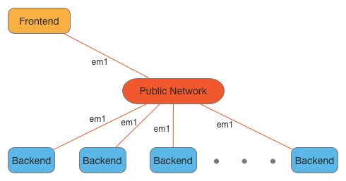
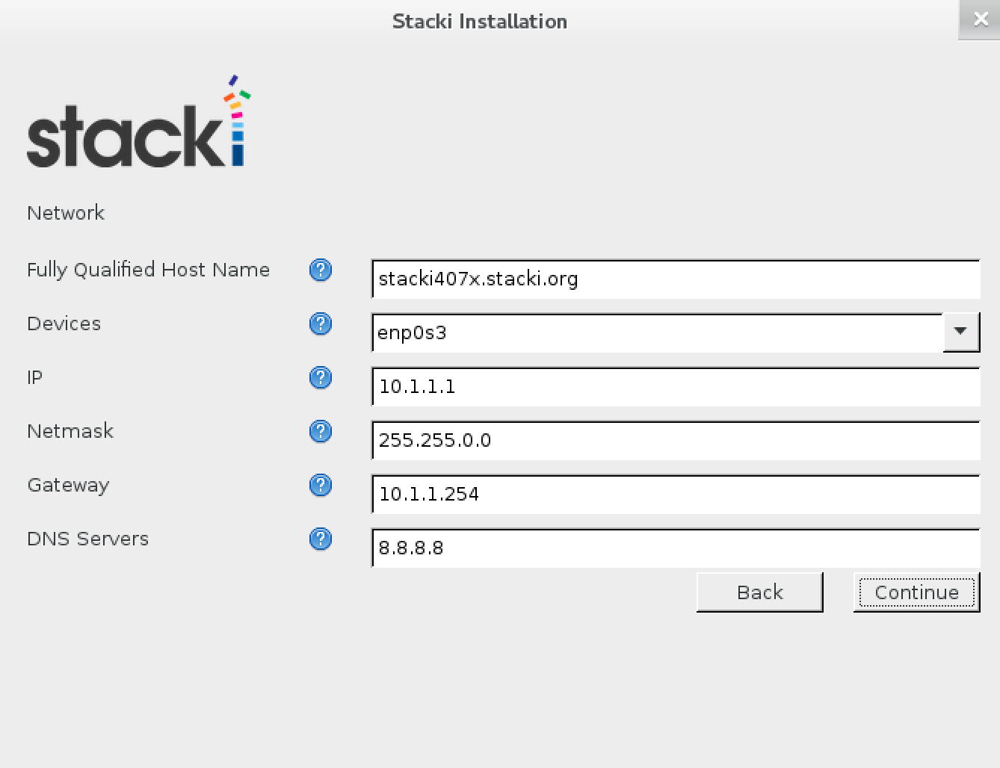
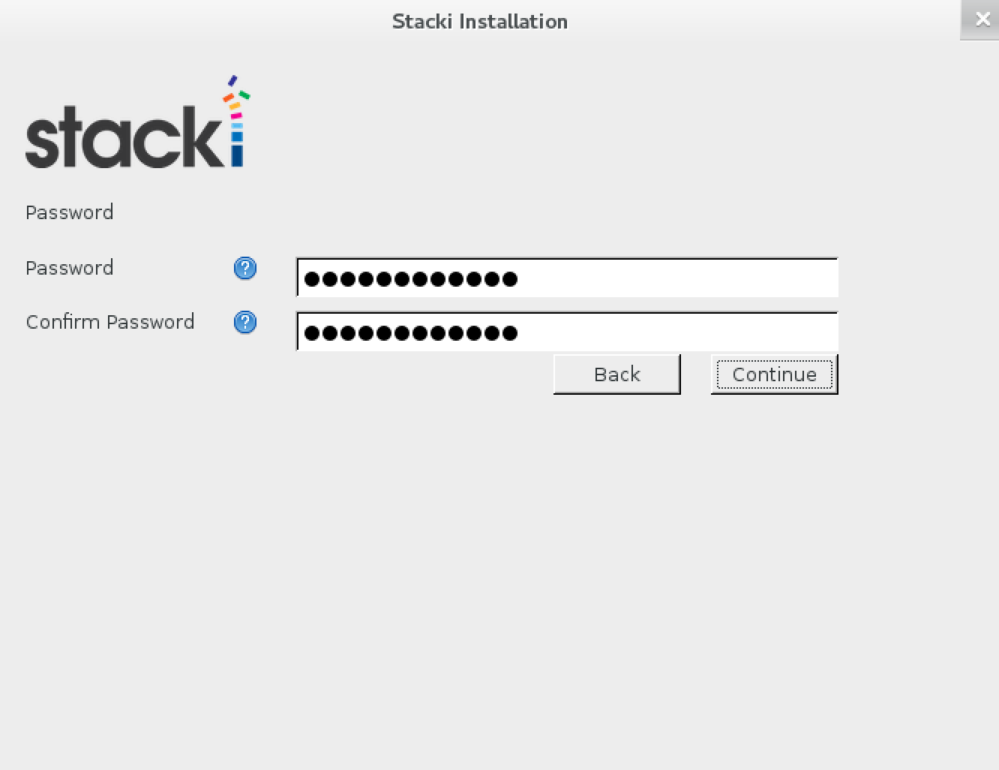

Stacki requires a single dedicated server that will host all 
the software and services used to build out other servers. We 
call this server the **frontend**, and the first step to running 
Stacki is to build a frontend. 

The process is fairly simple and looks similar to a standard Linux
build with the addition of a wizard to capture site-specific
networking information.

## Requirements 
 
A frontend has the following hardware requirements.  

**Resource** | Minimum | Recommended  
--- | --- | ---
**System Memory** | 2 GB | 16 GB  
**Network Interfaces** | 2 | 2  
**Disk Capacity** | 64 GB | 200GB  
**CD/DVD Device** | 1 | 1  
 
BIOS _boot order_
 
1. CD/DVD Device  
2. Hard Disk  
 
Stacki allows you to place only the frontend on your public network
and to then deploy all backend servers on an isolated private network.
This recommended setup is shown below.

You may also place all backend nodes on the public network and use
only a single network interface from the Stacki frontend, as shown
below.
If you choose to run in this configuration there are two additional
requirements.
First, the public network cannot have a DHCP server that would answer
a DHCP request from a backend server. (This is the frontend's job.)
Second, when in the installation wizard, you will still need to
configure both interfaces.
But in this case, simply configure the _public_ and _private_ with the
same network information but only cable the _private_ one (yes this is
odd, but it is required when you only have one interface for the frontend, and hey, _it works_).

 

## New or Existing

Stacki can build a [new](#new) frontend from bare metal or it can be added on
top of an existing server.
If you wish to install Stacki on top of an existing system, skip to the
section labeled [existing](#existing).

### New

Download the Stacki jumbo DVD [here](https://s3.amazonaws.com/stacki/1.0/stacki-os-1.0.x86_64.disk1.iso) and burn the file to a DVD or
mount it on the virtual media for the server to be installed.
Installing a frontend will completely erase and reformat the hard disks in the
server, so be careful which server you decide to become your frontend.

Boot the server with the DVD (or virtual media mounted) and the
following screen will appear after the BIOS is initialized:

If you don't see the above screen, go back to
the [requirements](#requirements) section and
make sure the DVD is the first entry in the boot order.

You can hit enter or just wait a few seconds and the Stacki
frontend installation will begin, and you will soon see the
[Installation Wizard](#installation-wizard).

### Existing

A Stacki frontend can be installed on top of an existing Red Hat based server.
The server must be running the x86_64 version of CentOS 6.x or RHEL 6.x.

To perform this installation, log into the Gnome (or generic X11)
environment on the servers console as root.
You must be root and X11 is required.

To start the installation, download two ISOs and put them on your server:

1. **Stacki**. The Stacki ISO can be found [here](http://stacki.s3.amazonaws.com/1.0/stacki-1.0-I.x86_64.disk1.iso).

2. **CentOS** or **RHEL** installation ISO. A CentOS installation ISO can be found [here](http://isoredirect.centos.org/centos/6/isos/x86_64/).

(If using RHEL, a DVD ISO should be available through your Red Hat subscription.)

Mount the Stacki ISO:

    # mount -o loop stacki*iso /media

Copy frontend-install.py from the ISO to your local disk:

    # cp /media/frontend-install.py /tmp

Execute frontend-install.py:

    # /tmp/frontend-install.py /path/to/stacki*iso stacki 1.0 /path/to/CentOS*iso CentOS 6.6

The above step will run several commands and will eventually display
the [Installation Wizard](#installation-wizard).

## Installation Wizard

### Cluster Information

The first screen will appear and you will be prompted to enter the following
info:

1. _Cluster Name_ - for example "Demo"
2. _Fully Qualified Host Name_ of the frontend (i.e., name.yourdomain.com)
3. _Email_ - Administrator Email
4. _Timezone_ of the cluster.

### Public Network

The public cluster network configuration screen allows you to set up the
networking parameters for the ethernet network that connects the frontend to the
outside network (e.g., the Internet).

1. Choose from the network _Devices_ to select the public network.
2. _IP_ address of the public interface.
3. _Netmask_.
4. _Gateway_.
5. _DNS Servers_ - More than one DNS Server can be entered as a comma-separated list (i.e., 8.8.8.8, 4.2.2.2, 8.8.4.4).

Click _Continue_ to configure the network interface. 

### Private Network

The private network configuration screen configures the
networking parameters for the ethernet network that
connects the frontend to the backend nodes.

1. Choose from the network _Devices_ to select the private network.
2. _IP_ address of the private interface.
3. _Netmask_.

Click _Continue_ to configure the network interface.
 

### Password

Enter the password for the **root** account on the frontend.  
(Something better than "bob" is recommended, and no, "12345" is not better than "bob".)

### Choose Partition

If _Automated_ mode is selected, the installer will
repartition and reformat the first discovered hard drive
that is connected to the frontend. All other drives
connected to the frontend will be left untouched.

| Partition Name | Size |
| --------------- | ---- |
|       /        | 16GB |
|       /var     | 16GB |
|       swap     |  1GB | 
| /export (symbolically linked to /state/partition1)|remainder of root disk|

When using automatic partitioning, the installer repartitions
and reformats the first hard drive (e.g. _sda_) that the installer
discovers. All previous data on this drive will be erased.
All other drives will be left untouched. If you are unsure about how
the drives will be discovered in a multi-disk frontend,
select _Manual_ mode.

In _Manual_ mode, the installer brings up a partition setup
screen after the wizard exits. In this mode, specify at least 16 GB
for the root partition and a separate /export partition. You should add
a swap partition, and /var if you have made / only 16GB.

### Add Pallets

Choose the _Pallets_ you want to install.
Booting from a DVD, pallets should automatically load onto the list for you to choose.

The _Id_ column denotes pallets loaded from a DVD and the _Network_ column denotes pallets from a network.

Select _stacki_ and _os_ pallets to install.

### Review

Review the installation parameters and click _Continue_ to proceed.

 

#### New

If this was a [new](#new) installation, the frontend will now format
its filesystems and copy the pallets from the DVD onto its hard disk.
Next, it will install all the packages and then run post configuration
scripts.
When this is complete, the frontend will reboot.
Your Stacki frontend is now ready to install backend servers.

#### Existing

If this was an [existing](#existing) installation, after the
_frontend-install.py_ program completes, you must reboot the frontend:

    # reboot

Your Stacki frontend is now ready to install backend servers.

