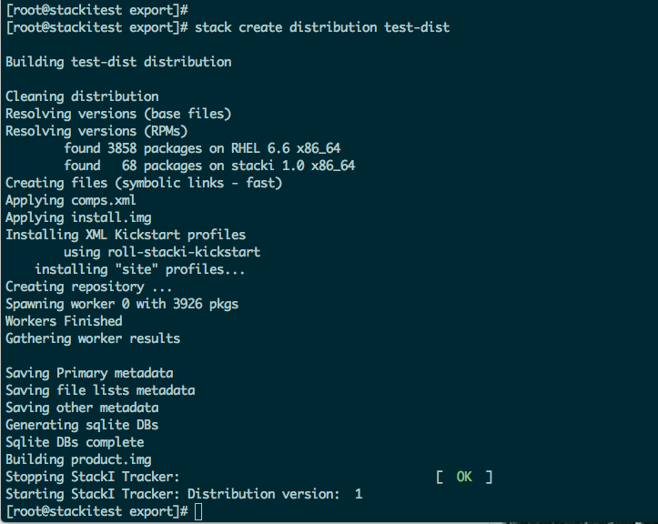

TODO: Document Boxes, Distributions are dead.

Stacki enables you to create a **distribution** which holds the Pallets a
particular machine will use for its software configuration.
The _default_ distribution consists of the _stacki_ and _OS_ pallets
(the OS pallet can be CentOS
or RHEL or any other RHEL variant in the 6.x series >= 6.5).
These two pallets are the minimal
requirement for installing a backend machine.
Backend machines are assigned the _default_ distribution automatically.

You can create additional distributions by adding ISOs you have downloaded or
have created from a mirrored repository with the _stack create mirror_ command.
Either way, the ISO is recognized as a pallet which can be enabled for the
_default_ distribution or enabled for a new distribution you have created. 

Different machines can be assigned different distributions.
This gives you a great deal of latitude in deciding
how to structure your environment for OS, applications, and updates.

A few examples:

* Maintaining different versions of the OS:

If you have installed with CentOS 6.5
and want to test on CentOS 6.6, add 6.6 as a pallet, create a new distribution,
assign machines to it, and install/reinstall.
The machine will have an updated version of the OS.

* Maintaining updates:

Pallets can be created by mirroring any publicly  available repo(or
subscribed repo if using RHEL).
Adding an _updates_ pallet to any distribution will make available to
Yum all updated RPMS.

* Maintaining dev/test/production environments:

Again, having created dev, test,
and production distributions with the appropriate pallets, assign machines to
each of those distributions.
Install/reinstall the machines.
When you want to
promote machines to a new environment, reassign the machine's
distribution and reinstall.

## Create a new distribution

A new distribution combines a set of application and OS pallets to install backend machines. Allowing for different versions of OS and applications to be on different machines for either testing or production services. 

This example will create a new distribution using RHEL 6.6 instead of CentOS 6.6. We'll then assign a machine to the new distribution.

% List distributions.

```
# stack list distribution
```


% Create a new distribution  

```
# stack add distribution test-dist
```


and list it to verify:

```
# stack list distribution
``` 


 

The "----"s indicate there are no pallets associated with the distribution, so add the minimum pallets: stacki and an OS pallet. Any application pallets may be added too.

% Add pallets to the distribution.

See which pallets are available:

```
# stack list pallet
```


% Enable RHEL and stacki pallets.

```
# stack enable pallet stacki RHEL distribution=test-dist
```

(a version may be required using the "version=" argument. The version is shown in the output of `# stack list pallet`)


% List to verify

```
# stack list distribution
```


% Make the distribution

```
# stack create distribution test-dist
```



## Using the distribution

There's not much point in creating a distribution if you don't use it. So, let's use it.

% Assign backend nodes to the distribution

```
# stack list host
```


```
# stack set host distribution backend distribution=test-dist
```
(Please note here "backend" is an appliance and will put all hosts of appliance-type "backend" into the "test-dist" distribution. I could have used a hostname or several hostnames or a hostname in regex here as well)


% Verify new host distribution
```
# stack list host
```


% Install/reinstall machines

```
# stack set host attr backend attr=nukedisks value=true
# stack set host boot backend action=install
# stack run host "reboot"
```

(With `stack run host`, not putting in a host designation will make it run on all hosts.)


Once the backend nodes install, they should have the new OS. Check /etc/redhat-release to verify.

```
# stack run host "cat /etc/redhat-release"
```


## Removing a Distribution

To remove a distribution, do the following:

% Reset the backend nodes to a valid distribution.

```
# stack set host distribution backend distribution=default
```


% Remove the distribution and verify it is gone.

```
# stack remove distribution test-dist
# stack list distribution
```


There is a little more work do, however. A `stack add distribution` creates two directories that allow for customizing the software and configuration of the backend nodes. These directories sit under /export/stack/contrib/_distribution_name_/ and /export/stack/site-profiles/_distribution_name_/.

Keeping with this example, remove these two directories:

```
# rm -fr /export/stack/contrib/test-dist
# rm -fr /export/stack/site-profiles/test-dist
```


% Reinstall backend machines

Since you've changed distributions on the backend machines, reinstall them as per the previous instruction.
